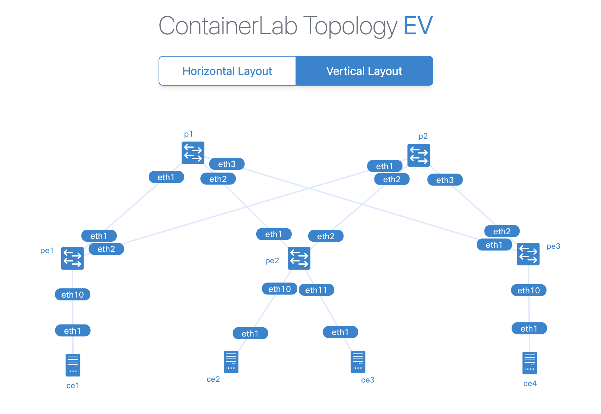

# Nokia SR OS EVPN over MPLS Lab
| Items | Description |
| --- | --- |
| Description | A lab to demonstrate EVPN over MPLS on Nokia SR OS with containerlab |
| Components | Nokia SR OS, Multitool Alpine Linux |
| Resource requirements | N/A |
| Topology file | sros-ev-mpls.clab.yml |
| Name | sros-ev-mpls |
| Version information | containerlab:0.54.2, vr-sros:23.10.R1, docker-ce:24.0.5 |

# Description
The lab has Nokia SR OS connected in a Clos topology: two nodes as Spine and three nodes as Leaf, all with management interfaces also connected to the containerlab docker network.
The Nokia SR OS VM is launched as a container using vrnetlab integration.
The configuration uses iBGP as the underlay, with the reachability of each neighbor via OSPF; the overlay runs EVPN over MPLS, and BUM handling is handled via ingress replication.
BUM handling is handled through Ingress Replication. Other settings include BFD and ECMP.
CE1 and CE2 are assigned to VLAN 10, CE3 and CE4 are assigned to VLAN 20, and there is no interconnectivity between VLAN 10 and VLAN 20.

- Topology: Clos
- Underlay: iBGP with OSPF
- Overlay: EVPN over MPLS
- BUM: Ingress Replication
- Others: BFD, ECMP
- Client: VLAN10, VLAN20



# Use cases
This lab allows you to launch a basic interoperability scenario for a multi-tenant environment on EVPN over MPLS using the Nokia SR OS.
The lab directory contains the basic configuration files used to start the interoperability demonstration.

# Parameters
| Role | Image | Hostname | IP address | VLAN |
| --- | --- | --- | --- | --- |
| Spine | SR OS | P1 | 10.0.0.1 | |
| Spine | SR OS | P2 | 10.0.0.2 | |
| Leaf | SR OS | PE1 | 10.0.0.11 | |
| Leaf | SR OS | PE2 | 10.0.0.12 | |
| Leaf | SR OS | PE3 | 10.0.0.13 | |
| Client | Alpine Linux | CE1 | 192.168.10.1 | 10 |
| Client | Alpine Linux | CE2 | 192.168.10.2 | 10 |
| Client | Alpine Linux | CE3 | 192.168.20.3 | 20 |
| Client | Alpine Linux | CE4 | 192.168.20.4 | 20 |

# Outputs
```
root@ip-10-10-0-37:~/sros-evpn-mpls-lab# clab inspect
INFO[0000] Parsing & checking topology file: sros-ev-mpls.clab.yml 
+---+------+--------------+---------------------------------+---------+---------+-----------------+----------------------+
| # | Name | Container ID |              Image              |  Kind   |  State  |  IPv4 Address   |     IPv6 Address     |
+---+------+--------------+---------------------------------+---------+---------+-----------------+----------------------+
| 1 | ce1  | 84dd37983bd8 | ghcr.io/hellt/network-multitool | linux   | running | 172.20.20.4/24  | 2001:172:20:20::4/64 |
| 2 | ce2  | 1255d3ac7bca | ghcr.io/hellt/network-multitool | linux   | running | 172.20.20.2/24  | 2001:172:20:20::2/64 |
| 3 | ce3  | 29dd5dac33da | ghcr.io/hellt/network-multitool | linux   | running | 172.20.20.3/24  | 2001:172:20:20::3/64 |
| 4 | ce4  | 79d7de760d89 | ghcr.io/hellt/network-multitool | linux   | running | 172.20.20.5/24  | 2001:172:20:20::5/64 |
| 5 | p1   | 4e7e9330ba15 | vrnetlab/vr-sros:23.10.R1       | vr-sros | running | 172.20.20.8/24  | 2001:172:20:20::8/64 |
| 6 | p2   | b8f2189dbd5f | vrnetlab/vr-sros:23.10.R1       | vr-sros | running | 172.20.20.7/24  | 2001:172:20:20::7/64 |
| 7 | pe1  | 4e543311061e | vrnetlab/vr-sros:23.10.R1       | vr-sros | running | 172.20.20.6/24  | 2001:172:20:20::6/64 |
| 8 | pe2  | b0c668dcdaf2 | vrnetlab/vr-sros:23.10.R1       | vr-sros | running | 172.20.20.9/24  | 2001:172:20:20::9/64 |
| 9 | pe3  | e4ffcb34d787 | vrnetlab/vr-sros:23.10.R1       | vr-sros | running | 172.20.20.10/24 | 2001:172:20:20::a/64 |
+---+------+--------------+---------------------------------+---------+---------+-----------------+----------------------+
root@ip-10-10-0-37:~/sros-evpn-mpls-lab# 
```
```
root@ip-10-10-0-37:~/sros-evpn-mpls-lab# docker exec -it ce1 ash
ce1:/# 
ce1:/# ping 192.168.10.2
PING 192.168.10.2 (192.168.10.2) 56(84) bytes of data.
64 bytes from 192.168.10.2: icmp_seq=1 ttl=64 time=2.84 ms
64 bytes from 192.168.10.2: icmp_seq=2 ttl=64 time=1.84 ms
^C
--- 192.168.10.2 ping statistics ---
2 packets transmitted, 2 received, 0% packet loss, time 1002ms
rtt min/avg/max/mdev = 1.844/2.343/2.842/0.499 ms
ce1:/# 
```
```
A:admin@PE1# show router bgp routes evpn incl-mcast
===============================================================================
 BGP Router ID:10.0.0.14        AS:65000       Local AS:65000      
===============================================================================
 Legend -
 Status codes  : u - used, s - suppressed, h - history, d - decayed, * - valid
                 l - leaked, x - stale, > - best, b - backup, p - purge
 Origin codes  : i - IGP, e - EGP, ? - incomplete

===============================================================================
BGP EVPN Inclusive-Mcast Routes
===============================================================================
Flag  Route Dist.         OrigAddr
      Tag                 NextHop
-------------------------------------------------------------------------------
i     10.0.0.11:10        10.0.0.11
      0                   10.0.0.11

i     10.0.0.11:10        10.0.0.11
      0                   10.0.0.11

u*>i  10.0.0.12:10        10.0.0.12
      0                   10.0.0.12

*i    10.0.0.12:10        10.0.0.12
      0                   10.0.0.12

-------------------------------------------------------------------------------
Routes : 4
===============================================================================

[/]
A:admin@PE1# 
```
```
A:admin@PE1# show router bgp routes evpn mac mac-address 00:00:00:00:11:11
===============================================================================
 BGP Router ID:10.0.0.14        AS:65000       Local AS:65000      
===============================================================================
 Legend -
 Status codes  : u - used, s - suppressed, h - history, d - decayed, * - valid
                 l - leaked, x - stale, > - best, b - backup, p - purge
 Origin codes  : i - IGP, e - EGP, ? - incomplete

===============================================================================
BGP EVPN MAC Routes
===============================================================================
Flag  Route Dist.         MacAddr           ESI
      Tag                 Mac Mobility      Label1
                          Ip Address        
                          NextHop           
-------------------------------------------------------------------------------
i     10.0.0.11:10        00:00:00:00:11:11 ESI-0
      0                   Seq:0             LABEL 524286
                          n/a
                          10.0.0.11

i     10.0.0.11:10        00:00:00:00:11:11 ESI-0
      0                   Seq:0             LABEL 524286
                          n/a
                          10.0.0.11

i     10.0.0.11:10        00:00:00:00:11:11 ESI-0
      0                   Seq:0             LABEL 524286
                          192.168.10.1
                          10.0.0.11

i     10.0.0.11:10        00:00:00:00:11:11 ESI-0
      0                   Seq:0             LABEL 524286
                          192.168.10.1
                          10.0.0.11

-------------------------------------------------------------------------------
Routes : 4
===============================================================================

[/]
A:admin@PE1# 
```
```
A:admin@PE1# show service id 10 proxy-arp detail
-------------------------------------------------------------------------------
Proxy Arp
-------------------------------------------------------------------------------
Admin State       : enabled             
Dyn Populate      : enabled             
Age Time          : disabled            Send Refresh      : disabled
Table Size        : 250                 Total             : 2
Static Count      : 0                   EVPN Count        : 1
Dynamic Count     : 1                   Duplicate Count   : 0
Process Probes    : enabled             

Dup Detect
-------------------------------------------------------------------------------
Detect Window     : 3 mins              Num Moves         : 5
Hold down         : 9 mins              
Anti Spoof MAC    : None

EVPN
-------------------------------------------------------------------------------
Garp Flood        : enabled             Req Flood         : enabled
Static Black Hole : disabled            
EVPN Route Tag    : 0                   
-------------------------------------------------------------------------------

===============================================================================
VPLS Proxy Arp Entries
===============================================================================
IP Address          Mac Address         Type  Status Flags  Last Update
-------------------------------------------------------------------------------
192.168.10.1        00:00:00:00:11:11   dyn   active        04/28/2024 16:13:20
192.168.10.2        00:00:00:00:22:22   evpn  active        04/28/2024 16:07:17
-------------------------------------------------------------------------------
Number of entries : 2
Legend : I=Immutable
===============================================================================

[/]
A:admin@PE1# 
```
